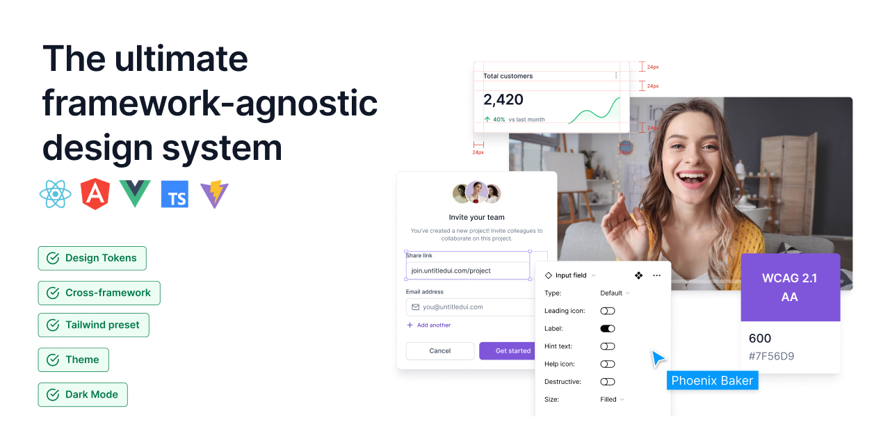

# Monorepo Design System (Tokens → Tailwind Preset → Multi-Framework)

[](https://github.com/iamcucusa/untitled/actions/workflows/ci.yml)
[](https://github.com/iamcucusa/untitled/actions/workflows/a11y.yml)
[](https://github.com/iamcucusa/untitled/actions/workflows/deploy-pages.yml)

Cross-framework design system used by React (demo app today) and ready for Angular/Vue.  
Focus: **design tokens → Tailwind preset → small, framework-agnostic CSS layers**, with measurable
**accessibility**. Now includes **Intl utilities** (`@untitled-ds/intl-core`) for locale
negotiation, currency, date, and plural formatting.

## Quick start

```bash
 pnpm i
 pnpm -C packages/tokens build   # tokens → dist/css/variables.css + dist/tailwind/preset.cjs
 pnpm dev                        # React app on http://localhost:5173
```

## Dev tips

This repo uses **dist-only consumption** for internal packages. Run the build libs before running
the apps:

```bash
pnpm build:libs
```

To watch and rebuild libs while running the app

```bash
pnpm dev:watch
```

## Accessibility (measured)

### Targets

- WCAG 2.1 AA.
- Lighthouse Accessibility ≥ **98**
- axe: **0 serious/critical violations**.

### Implemented

- **Skip link** + clean landmarks `(header, main)`
- **Reduced motion:** `prefers-reduced-motion`, zeros token durations; global clamp covers
  third-party CSS.
- **Dialogs:** `aria-modal`, `role="dialog"`, focus trap, Escape to close, focus restore to trigger
- **Forms:** labels, hints/errors wired via `aria-describedby`, `aria-invalid`, `role="alert"`.
- **Choice groups:** `fieldset/legend` with group-level hint/error and tokenized invalid state

### Local accessibility audits

First time on a machine:

```bash
 pnpm exec playwright install --with-deps
```

Any time:

```bash
 pnpm run a11y:lh   # Lighthouse (Accessibility report → lhci-report/)
 pnpm run a11y:axe  # Playwright + axe (0 serious/critical violations)
 pnpm run a11y:rm   # Reduced-motion spec (transitions collapse under PRM)
```

## Structure

### Packages

- `@untitled-ds/tokens` — source of truth → CSS variables + Tailwind preset
- `@untitled-ds/styles` — global CSS layers (base, components, utilities)
- `@untitled-ds/presets` — Tailwind preset entry (maps tokens → theme)
- `@untitled-ds/intl-core` — **lightweight Intl wrappers** for number, date, currency, plural, and
  locale negotiation

### Apps

- `apps/web-react` — Vite + React sample consuming the DS

## Use in Angular / Vue

Tailwind config (consume the preset built by tokens):

```
// tailwind.config.cjs
module.exports = {
darkMode: 'class',
presets: [require('@untitled-ds/tokens/dist/tailwind/preset.cjs')],
content: ['./src/**/*.{html,ts,vue,js,tsx}'],
};
```

Entry CSS (imports FIRST, then Tailwind layers):

- @import '@untitled-ds/tokens/dist/css/variables.css';
- @import '@untitled-ds/styles/src/base.css';
- @import '@untitled-ds/styles/src/components.css';
- @import '@untitled-ds/styles/src/utilities.css';

- @tailwind base;
- @tailwind components;
- @tailwind utilities;
